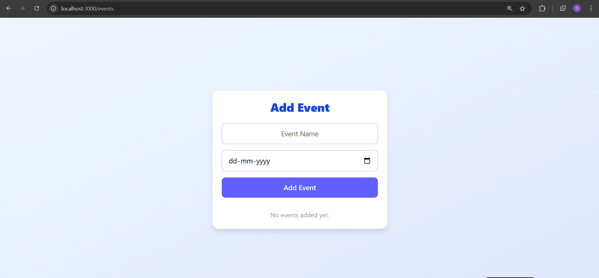

# Event Manager App


## How to Run

1. Install dependencies:
   ```bash
   pnpm install
   ```
2. Start the development server:
   ```bash
   pnpm turbo run dev --filter=event-manager
   ```

3. Navigate to the app:
- Open your browser and go to `http://localhost:3000/events`.

## Notes / Assumptions

- This app is fully client-side: no database or API routes are used.
- State is managed with Zustand; form handling uses React Hook Form.
- All events are stored in-memory and will reset on page reload.
- The UI is styled with Tailwind CSS and is mobile-friendly.

## Screenshot



